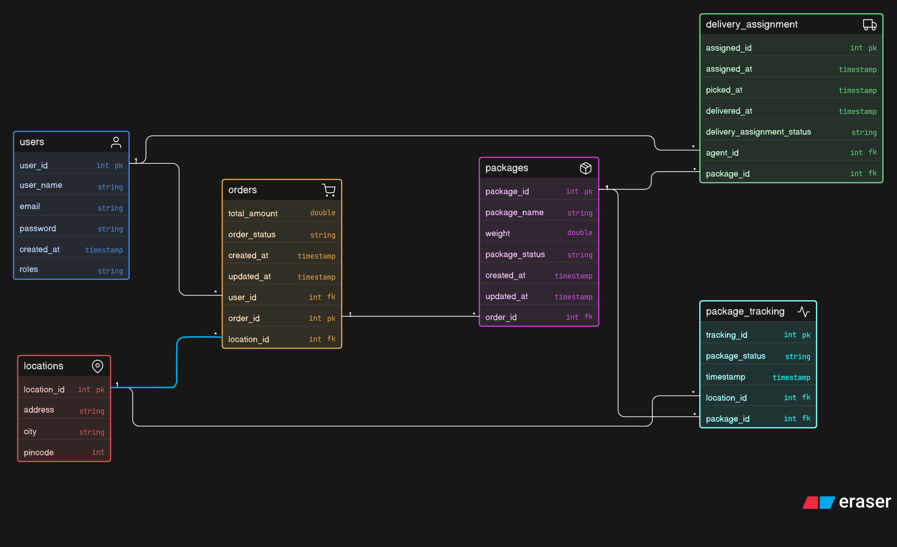

📦 Smart Courier Management System

A scalable backend system built using Java, Spring Boot, Spring Security (JWT), and MySQL to manage end-to-end courier operations including order placement, delivery assignment, tracking, and user management.

🚀 Features
- JWT-based Authentication & Authorization
- Role-Based Access Control (RBAC) (Admin, Manager, Agent, Customer)
- Order & Package Management
- Delivery Assignment & Reassignment
- Real-time Package Tracking
- Asynchronous Processing using @Async
- Scheduled Jobs using @Scheduled
- Global Exception Handling

1.	Authentication & Authorization
- JWT-based authentication using Spring Security 
- Role-Based Access Control (RBAC): 
- ADMIN – Manage users 
- MANAGER – Assign & monitor deliveries AGENT – Handle deliveries 
- CUSTOMER – Place & track orders 

2.	Order Management
- Customers can place orders with: 
- Address, city, Pincode
-	Multiple packages (name, weight) 
-	Auto creation of: -o	Order 
-	Packages 
-	Location 

4.	Delivery Management
-	Manager assigns packages to agents 
-	Package status lifecycle:
 CREATED → IN_TRANSIT → DELIVERED / FAILED
- ailed deliveries can be reassigned 

5.	Package Tracking
- Real-time tracking with: 
- Status updates 
- Timestamp 
- Location 
                                                                                                      Full tracking history maintained 

 System Features
•	Exception Handling (Global) 
•	Validation using Jakarta Validation 
•	Async Processing (@Async for bulk assignment) 
•	Scheduled Jobs (@Scheduled for automation) 
•	Secure password storage (BCrypt) 

 Design Highlights
•	Normalized database design 
•	Foreign keys maintain referential integrity 
•	Tracking table stores full history (audit trail) 
•	Separate Delivery Assignment table for flexibility (reassignment support)

🏗️ Tech Stack

| Layer      | Technology           |
| ---------- | -------------------- |
| Backend    | Java, Spring Boot    |
| Security   | Spring Security, JWT |
| Database   | MySQL                |
| ORM        | Hibernate / JPA      |
| Build Tool | Maven                |
| Utilities  | Lombok               |
| Testing    | Postman              |

🗄️ Database Design

The system is designed using relational database principles with the following core entities:

- Users
- Orders
- Packages
- Locations
- DeliveryAssignment
- PackageTracking

FULL SYSTEM FLOW (YOUR SCENARIO)
- Customer → Place Order
        ↓
- Order → Packages (CREATED)
        ↓
- Manager → Assign Package → Agent
        ↓
- Agent → Pickup → IN_TRANSIT → OUT_FOR_DELIVERY
        ↓
- Success → DELIVERED ✅
- Failure → FAILED ❌
        ↓
- Manager → Reassign → Agent
        ↓
- Repeat until DELIVERED
        ↓
- Customer → Track anytime

📌 ER Diagram

  
   
  <em>Figure: Entity Relationship Diagram of Smart Courier System</em>

🔗 API Overview
🔐 Authentication APIs
Register
- POST /courier/auth/signup

Login
- POST /courier/auth/login

Customer: 
📦 Order APIs
Place Order
- POST /courier/orders

📍 Tracking APIs
Track Package
- GET /courier/tracking/{packageId}

👷 Manager APIs

Get All Agents: 
- GET / courier/manager/all-agents?page=0&size=10&sortBy=userId&sortDir=asc

Get All Assignments
- GET / courier/manager/all-assignments?page=0&size=10&sortBy=assignedId&sortDir=asc
 
Get Dashboard
- GET/ courier/admin/dashboard

🚚 Delivery APIs
Assign Package
- POST /courier/manager/assign

👷 Agent APIs
- Get Assigned Packages
- GET /courier/agent/packages

Update Status
- POST /courier/agent/update-status

👑 Admin APIs
- Get All Users      GET /courier/admin/users
- Get User By Id     GET/ courier/admin/users/5
- Delete User        DELETE/ courier/admin/users/8
- Update User Roles  PATCH/ courier/admin/users/7/role

🔐 Role-Based Access
| Role     | Permissions                   |
| -------- | ----------------------------- |
| ADMIN    | Full system access            |
| MANAGER  | Assign & monitor deliveries   |
| AGENT    | Update delivery status        |
| CUSTOMER | Place orders & track packages |

⚙️ Key Highlights
- Secure authentication using JWT
- Clean architecture with DTO + Service + Repository layers
- Efficient database handling using JPA & Hibernate
- Asynchronous processing for performance optimization
- Scalable and modular design

      
🔄 System Flow

→Customer → Place Order  
→ Manager Assigns Delivery  
→ Agent Delivers Package  
→ System Updates Tracking  
→ Customer Tracks Package

👨‍💻 Author

Harsh Chopda
Backend Developer

📍 Open to Work (Remote / On-site)

